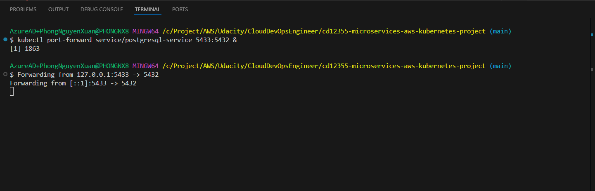
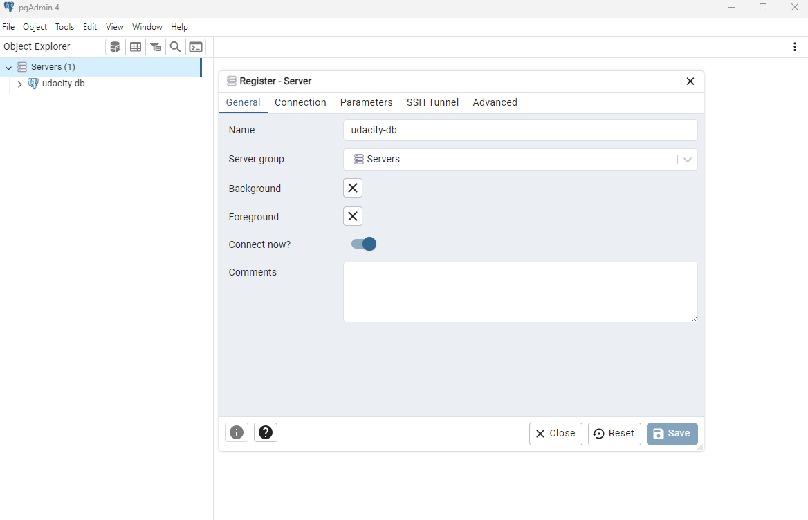

# Coworking Space Service Extension
The Coworking Space Service is a set of APIs that enables users to request one-time tokens and administrators to authorize access to a coworking space. This service follows a microservice pattern and the APIs are split into distinct services that can be deployed and managed independently of one another.

For this project, you are a DevOps engineer who will be collaborating with a team that is building an API for business analysts. The API provides business analysts basic analytics data on user activity in the service. The application they provide you functions as expected locally and you are expected to help build a pipeline to deploy it in Kubernetes.

## Getting Started

### Dependencies
#### Local Environment
1. Python Environment - run Python 3.6+ applications and install Python dependencies via `pip`
2. Docker CLI - build and run Docker images locally
3. `kubectl` - run commands against a Kubernetes cluster
4. `helm` - apply Helm Charts to a Kubernetes cluster

#### Remote Resources
1. AWS CodeBuild - build Docker images remotely
2. AWS ECR - host Docker images
3. Kubernetes Environment with AWS EKS - run applications in k8s
4. AWS CloudWatch - monitor activity and logs in EKS
5. GitHub - pull and clone code

### Setup
#### 1. Configure a Database
Set up a Postgres database using a Helm Chart.

1. Create Cluster
```
create_cluster.sh
```

Verify and copy the context name

```
kubectl config current-context
```

2. Config DB Storage

```
kubectl apply -f local/pvc.yaml
kubectl apply -f local/pv.yaml
kubectl apply -f local/postgresql-deployment.yaml
kubectl apply -f local/postgresql-service.yaml

```

3. Test Database Connection
View the pods and service

```
kubectl get pods
kubectl get svc
```

4. Set up port-forwarding to `postgresql-service`

```
kubectl port-forward service/postgresql-service 5433:5432 &
```



Use postgresql client like `PgAdmin 4` for connect to DB and seed data



5. Run Seed Files

Copy and run sql statements in `db` directory on pgAdmin 4 SQL Editor

### 2. Running the Analytics Application
1. Create ECR `coworking-analytics`
2. Create CodeBuild Project
3. Deployment
```
kubectl apply -f deployment/secret.yaml
kubectl apply -f deployment/configmap.yaml
kubectl apply -f deployment/coworking.yaml
```

4. Setting Cloudwatch log

- Add policy fo Node Group Role

```
aws iam attach-role-policy \
--role-name <cluster-nodegroup-Role> \
--policy-arn arn:aws:iam::aws:policy/CloudWatchAgentServerPolicy 
```

- Add addon
```
aws eks create-addon --addon-name amazon-cloudwatch-observability --cluster-name my-cluster
```

